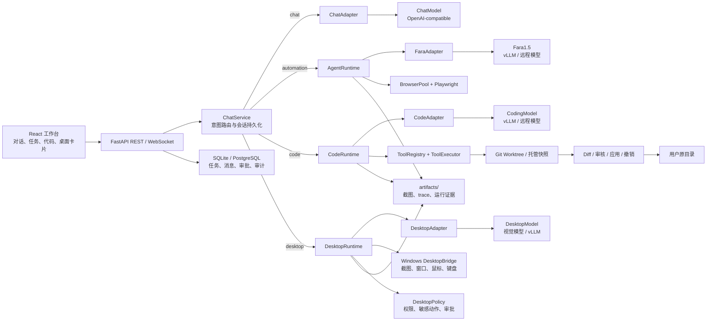

# FaraFlow

FaraFlow 是一个带安全边界的本地 Agent 工作台。它将普通聊天、Microsoft Fara1.5
浏览器自动化、本地代码工作区和 Windows 桌面控制放进独立执行平面，并统一提供会话、审批、Diff 审核、
安全策略和审计记录。

当前仓库实现的是可运行 MVP，已经包含以下框架：

- Fara1.5-9B/27B + vLLM OpenAI-compatible 推理适配，可连接本机或远程模型服务器；
- React 19 + Vite 对话工作区，支持普通问答与自动化请求的统一入口；
- `ChatService` 四路意图路由：普通聊天、浏览器自动化、本地代码任务和 Windows 桌面控制；
- 本机文件夹注册与工作区绑定对话，支持自动/聊天/浏览器/代码模式切换；
- 独立 `CodeRuntime` + OpenAI-compatible CodingModel，不回退到 Fara 浏览器模型；
- 独立 `DesktopRuntime` + OpenAI-compatible DesktopModel，通过 Windows DesktopBridge 执行受控截图、鼠标和键盘动作；
- 干净 Git 仓库使用 detached worktree，脏仓库或普通文件夹使用托管快照；
- 代码文件树、工具时间线、统一 Diff，以及人工应用、丢弃和撤销；
- 代码工具仅允许受控文件读写与 Git 状态/Diff，不开放任意 Shell、commit 或 push；
- 自动化任务控制台：任务计划、浏览器截图、执行时间线、审批提示和运行状态；
- 深色/浅色主题切换，并将用户选择保存到浏览器本地存储；
- `AgentRuntime` 浏览器 Agent 主循环：截图 → 模型决策 → 安全检查 → Playwright 执行 → 结果回传；
- Playwright 1440×900 隔离 BrowserContext 与并发会话池；
- Fara 官方 `computer_use` XML/JSON 工具协议与 1000×1000 坐标映射；
- 域名白名单、私网拦截、页面提示注入检测；
- 提交、购买、删除、发送和登录控件的模型外审批拦截；
- 任务、Session、Action、Approval、Event、Skill 持久化；
- 暂停、补充信息、一次性 resume token 与浏览器登录态 checkpoint；
- 截图、Playwright trace 和动作参数脱敏审计；
- FastAPI REST/WebSocket API 与 React 实时控制台；
- PostgreSQL、Redis、MinIO、Temporal 和 A6000/vLLM 部署基线。

## 系统架构


当前请求路由与执行边界如下：



## 目录结构

```text
backend/faraflow/
  api/               FastAPI 路由、生命周期和 WebSocket 事件接口
  browser/           BrowserPool、Playwright 隔离执行平面
  domain/            API 请求/响应模型与任务状态枚举
  infra/             SQLAlchemy、Repository、工件与事件设施
  model/             Fara1.5 协议解析和 vLLM 适配器
  runtime/           ChatService、TaskService、AgentRuntime、路由编排
  code/              CodeAdapter、CodeRuntime、工具协议和执行器
  desktop/           Windows 桌面桥接、截图、动作策略、审批和 DesktopRuntime
  workspace/         路径安全、隔离副本、Diff、备份和应用/撤销
  security/          域名白名单、关键动作审批、注入检测
frontend/
  src/App.tsx        对话、任务、审批和主题切换界面
  src/CodeWorkspace.tsx  文件树、代码运行时间线和 Diff 审核
  src/WorkspaceModal.tsx 本机绝对路径注册弹窗
  src/api.ts         REST 与 WebSocket 客户端
  src/types.ts       前端领域类型
  src/styles.css     控制台视觉主题
data/                本地 SQLite 数据库（开发运行时生成）
data/code-workspaces/ 代码任务隔离目录（运行结束后按状态清理）
artifacts/           截图与 Playwright trace（开发运行时生成）
artifacts/code-runs/  代码 Diff、基线、应用备份和审计工件
browser-state/       浏览器登录态 checkpoint（开发运行时生成）
migrations/          Alembic 无损数据库迁移
deploy/              容器、安全与 A6000 部署文件
tests/               单元、API、浏览器和 Agent 运行时测试
```

## 当前运行链路

用户从控制台发送消息后，后端先由 `ChatService` 判断请求类型：

1. 普通问答、解释或写作请求调用独立 `ChatAdapter`；未配置专用对话模型时才复用 Fara 接口，并将消息保存到 SQLite。
2. 搜索、打开、访问或查询实时网页时，系统创建自动化任务并交给 `AgentRuntime`。
3. `AgentRuntime` 为任务创建隔离浏览器会话，循环执行“截图 → Fara 决策 → 安全策略 → Playwright 动作”。
4. 每个动作会写入 Action/Event 记录；截图和 Playwright trace 保存到 `artifacts/`，浏览器登录态保存到 `browser-state/`。
5. 任务完成、暂停、等待用户输入、等待审批、触发安全接管或失败时，状态通过 REST 和 WebSocket 同步到前端。
6. 绑定工作区的代码请求交给独立 `CodeRuntime`；模型只能在隔离目录调用显式注册的文件工具。
7. 代码运行结束后生成统一 Diff 并进入 `REVIEW_REQUIRED`，确认前不修改原目录；应用和撤销都会执行哈希冲突检查。
8. 明确要求控制本机桌面时，消息进入 `DesktopRuntime`；用户先选择目标窗口，模型根据截图生成受控动作，`DesktopPolicy` 在执行前检查敏感操作并按需请求审批。

当前开发环境可以把 `.env` 中的模型配置指向远程 vLLM OpenAI API，例如：

```dotenv
FARAFLOW_FARA_BASE_URL=http://10.65.1.110:8003/v1
FARAFLOW_FARA_MODEL=microsoft/Fara1.5-27B
FARAFLOW_FARA_API_KEY=not-needed
```

如果模型部署在内网服务器，将 `FARAFLOW_FARA_BASE_URL` 改成该服务器的 `/v1` 地址即可，前端和后端不需要修改模型调用代码。

对话模型可以单独配置；如果下面两个配置保持为空，普通对话和意图路由会自动复用
`FARAFLOW_FARA_*` 指向的 Fara 模型：

```dotenv
FARAFLOW_CHAT_BASE_URL=
FARAFLOW_CHAT_API_KEY=
FARAFLOW_CHAT_MODEL=
```

只有同时配置 `FARAFLOW_CHAT_BASE_URL` 和 `FARAFLOW_CHAT_MODEL` 时，才会启用独立
对话模型；否则普通聊天会复用 `FARAFLOW_FARA_*`。`/health/ready` 会分别显示浏览器模型、
对话模型、代码模型和桌面模型状态。

当前内网部署可以将普通聊天和代码模型指向 110 服务器上的 Qwen vLLM，将浏览器和桌面
控制指向 27B Fara vLLM（端口和模型名按服务器实际状态调整）：

```dotenv
FARAFLOW_CHAT_BASE_URL=http://10.65.1.110:8002/v1
FARAFLOW_CHAT_MODEL=qwen-27b-int4
FARAFLOW_CODE_BASE_URL=http://10.65.1.110:8002/v1
FARAFLOW_CODE_MODEL=qwen-27b-int4
FARAFLOW_FARA_BASE_URL=http://10.65.1.110:8003/v1
FARAFLOW_FARA_MODEL=microsoft/Fara1.5-27B
```
普通聊天使用 NDJSON 流式接口逐段更新前端；对支持 thinking 开关的 Qwen/vLLM
部署，可以设置 `FARAFLOW_CHAT_DISABLE_THINKING=true` 作为默认值。聊天输入区的“深度
思考”按钮允许用户为单条消息覆盖默认值；开启后，模型返回的思考文本会实时显示在
可折叠面板中，最终正文开始输出时自动折叠，并随消息持久化以便之后重新查看。

本地代码工作区默认关闭。启用时后端必须只监听 loopback，并配置允许注册的父目录和
独立 CodingModel：

```dotenv
FARAFLOW_API_HOST=127.0.0.1
FARAFLOW_ENABLE_LOCAL_WORKSPACES=true
FARAFLOW_WORKSPACE_ALLOWED_ROOTS=["C:/Users/Peter/Desktop"]
FARAFLOW_CODE_WORK_ROOT=./data/code-workspaces
FARAFLOW_CODE_BASE_URL=http://10.65.1.110:8002/v1
FARAFLOW_CODE_API_KEY=not-needed
FARAFLOW_CODE_MODEL=qwen-27b-int4
FARAFLOW_CODE_MAX_STEPS=50
FARAFLOW_CODE_MAX_RUNTIME_MINUTES=20
FARAFLOW_CODE_MAX_CONCURRENT_RUNS=1
```

启用后，工作区 API 仍只接受来自 `127.0.0.1`/`::1` 的请求。代码模型与 Fara 模型
相互独立；CodingModel 缺失或不可用时会在 `/health/ready` 中明确显示，不会回退到
浏览器模型。在 Windows 本机模式下，“添加本机文件夹”可以直接打开系统文件夹选择器；
选择结果仍必须位于 `FARAFLOW_WORKSPACE_ALLOWED_ROOTS` 配置的目录内，也可以继续手动
输入绝对路径。

桌面控制是独立的本机执行平面，默认关闭。启用后 API 必须绑定 `127.0.0.1`，并为视觉
模型单独配置 OpenAI-compatible 端点；浏览器自动化和桌面控制可以共用 Fara 模型，但运行
时仍使用不同的 Runtime、会话和安全策略：

```dotenv
FARAFLOW_API_HOST=127.0.0.1
FARAFLOW_ENABLE_DESKTOP_CONTROL=true
FARAFLOW_DESKTOP_BASE_URL=http://10.65.1.110:8003/v1
FARAFLOW_DESKTOP_API_KEY=not-needed
FARAFLOW_DESKTOP_MODEL=microsoft/Fara1.5-27B
FARAFLOW_DESKTOP_CAPTURE_MODE=window
FARAFLOW_DESKTOP_REQUIRE_CONFIRMATION=true
FARAFLOW_DESKTOP_MAX_STEPS=50
FARAFLOW_DESKTOP_MAX_RUNTIME_MINUTES=15
FARAFLOW_DESKTOP_MAX_CONCURRENT_RUNS=1
```

Windows 本机首次启用时，先安装截图依赖：

```powershell
python -m pip install -e ".[desktop]"
```

桌面任务不会启动进程、提权、处理 UAC 或执行任意 Shell；首版只控制用户选择的可见
Windows 窗口，并在截图前后记录审计证据。涉及输入、拖动、右键和系统快捷键的动作会
按策略暂停等待确认。Windows 11 桌面图标操作通过 `FolderView` 桥接执行，目标窗口
不可见或桌面截图不可用时任务会安全失败。

## 本地开发

控制面支持 Python 3.8+（生产建议 3.11+），前端要求 Node.js 20+。模型服务器建议
运行在 Linux GPU 主机；Windows 可直接使用现有 Conda 环境开发。

使用 Conda：

```powershell
conda create -n faraflow python=3.11 -y
conda activate faraflow
Copy-Item .env.example .env
python -m pip install -e ".[dev]"
python -m playwright install chromium
alembic upgrade head
uvicorn faraflow.api.main:app --host 127.0.0.1 --port 8080
```

Linux/WSL2 也可以使用独立虚拟环境：

```bash
cp .env.example .env
python3 -m venv .venv
source .venv/bin/activate
pip install -e ".[dev]"
playwright install chromium
alembic upgrade head
uvicorn faraflow.api.main:app --host 127.0.0.1 --port 8080
```

另开终端启动控制台：

```bash
cd frontend
npm install
npm run dev
```

访问 `http://localhost:5173`；OpenAPI 文档位于
`http://localhost:8080/docs`。

运行自动化校验：

```powershell
python -m ruff check backend
python -m pytest -q
Set-Location frontend
npm run typecheck
npm test
npm run build
```

前端开发服务器也只监听 `127.0.0.1`，避免其 `/v1` 代理把仅限本机的 Workspace
接口意外暴露到局域网。

默认使用 SQLite，适合本地开发。将 `FARAFLOW_DATABASE_URL` 改为
`postgresql+asyncpg://...` 即可切换 PostgreSQL。

当前 MVP 的任务循环在 API 进程内运行；Compose 已包含 Temporal 服务，供生产阶段
将同一状态机迁移为 durable workflow。单机部署应先用单个 API worker，避免重复执行。

主要 API 包括：

- `POST /v1/chats`、`POST /v1/chats/{chat_id}/messages`：创建对话并发送消息；
- `POST|GET|DELETE /v1/workspaces`：注册、查看或取消注册本机工作区；
- `GET /v1/workspaces/{id}/tree|files`：读取经过安全过滤的目录树和文本文件；
- `POST|GET /v1/code-runs`：创建或查看隔离代码运行；
- `GET /v1/code-runs/{id}/diff`：查看统一 Diff；
- `POST /v1/code-runs/{id}/apply|revert|discard`：应用、撤销或丢弃修改；
- `POST|GET /v1/desktop-runs`：创建或查看本机桌面控制运行；
- `GET /v1/desktop-runs/windows`、`POST /v1/desktop-runs/{id}/select-window`：枚举并选择目标窗口；
- `POST /v1/desktop-runs/{id}/start|pause|terminate`：控制桌面运行生命周期；
- `GET /v1/desktop-runs/{id}/approvals`、`POST /v1/desktop-runs/{id}/approvals/{approval_id}`：查看和处理敏感动作审批；
- `POST /v1/tasks`：直接创建自动化任务；
- `POST /v1/tasks/{task_id}/start|pause|terminate|respond`：控制任务生命周期；
- `POST /v1/tasks/{task_id}/approvals/{approval_id}`：处理高风险动作审批；
- `WS /v1/sessions/{session_id}/events`：接收实时执行事件；
- `GET /v1/artifacts/{artifact_path}`：查看任务截图和 trace 工件。

## A6000 一键部署

部署机需要：

- Ubuntu 22.04/24.04；
- NVIDIA RTX A6000 48GB 与可用驱动；
- Docker Engine、Compose plugin、NVIDIA Container Toolkit；
- 至少 150GB 可用磁盘用于镜像、模型权重与工件。

```bash
cp .env.example .env
./deploy/a6000/preflight.sh
docker compose -f docker-compose.yml -f docker-compose.a6000.yml up -d --build
```

上线前先修改 `.env` 中的 PostgreSQL/MinIO 口令；若 Hugging Face 下载需要鉴权，
再填入 `HF_TOKEN`。首次启动会下载 `microsoft/Fara1.5-9B`。查看状态：

```bash
docker compose -f docker-compose.yml -f docker-compose.a6000.yml ps
docker compose -f docker-compose.yml -f docker-compose.a6000.yml logs -f vllm
curl http://localhost:5000/v1/models
curl http://localhost:8080/health/ready
```

默认 `VLLM_MAX_MODEL_LEN=65536`，这是单张 A6000 上更保守的生产起点。完成显存与
长轨迹压测后可以逐步提高到模型支持的 262144。FaraFlow 每次只保留最近三张截图，
通常无需为普通浏览器任务直接打开完整上下文。

## 最小 API 示例

```bash
curl -X POST http://localhost:8080/v1/tasks \
  -H 'Content-Type: application/json' \
  -d '{
    "task_name": "官网更新检索",
    "description": "查找 Microsoft Fara1.5 的主要能力并给出简短总结，不要登录或提交表单",
    "start_url": "https://www.bing.com/",
    "allowed_domains": ["bing.com", "microsoft.com", "github.com", "huggingface.co"]
  }'
```

使用响应中的 `task_id` 启动：

```bash
curl -X POST http://localhost:8080/v1/tasks/TASK_ID/start
```

## 安全说明

- 不要把真实凭证写进任务描述、`.env` 示例、日志或 Skill manifest。
- 本地代码工具屏蔽 `.git`、`.env*`（仅保留 `.env.example`）、私钥、凭证、依赖目录、缓存和二进制文件。
- 修改或删除已有文件前强制重新读取；写操作仅发生在隔离目录，并记录前后哈希、影响路径和 Diff。
- 应用与撤销前会检查原文件哈希。发现人工修改时返回 HTTP 409，不覆盖用户的新内容。
- 删除 Workspace 只取消注册，绝不会删除用户原目录；首版不提供任意 Shell、自动 commit 或 push。
- 生产环境应在 API 前加入 OIDC/RBAC，并把 resume token 绑定当前用户和租户。
- 浏览器层 allow-list 之外，还应使用 NetworkPolicy/egress proxy 做第二层限制。
- 当前提示注入检测采取安全优先策略，命中后进入 `HANDOFF`；需人工检查页面。
- Fara1.5 是研究预览模型。高风险领域和生产流程必须先做场景回归与人工监督。

模型与参考实现：
[Fara1.5 模型集合](https://huggingface.co/collections/microsoft/fara15)、
[Microsoft Fara 官方仓库](https://github.com/microsoft/fara)。
